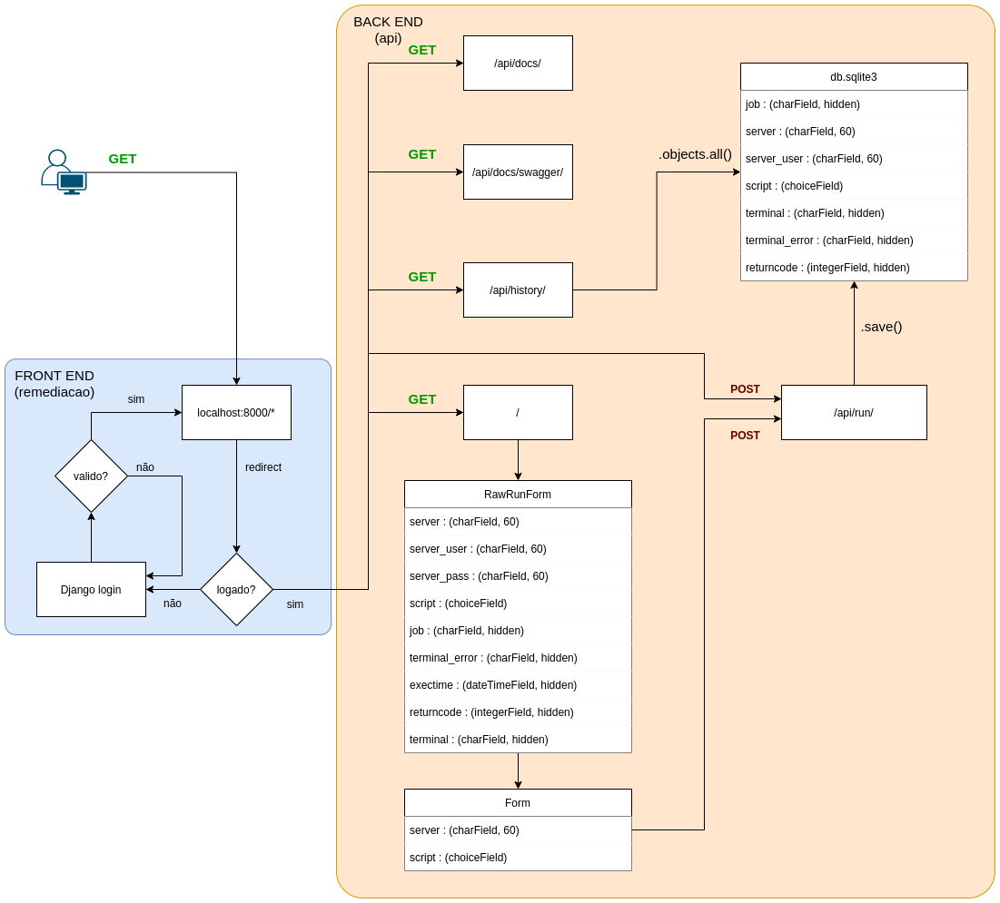

# Case Eng Automação

## Estrutura
```
.
├── Dockerfile
├── README.md
├── api -> (backend)
│   ├── admin.py
│   ├── apps.py
│   ├── migrations
│   ├── models.py 
│   ├── serializers.py
│   ├── templates
│   ├── tests.py
│   ├── urls.py
│   └── views.py
├── db.sqlite3 -> (DB local)
├── manage.py
├── remediacao -> (front end)
│   ├── asgi.py
│   ├── pages
│   ├── scripts -> (scripts )
│   ├── settings.py
│   ├── urls.py
│   └── wsgi.py
├── requirements.txt
└── tests
    └── validacao_post.json
```
## Execução

```
 python3 manage.py runserver 0.0.0.0:8000
```

## Arquitetura da Solução



## Exemplos de chamadas de API

### Acionar uma remediação
```
import requests
import json

url = "http://127.0.0.1:8000/api/run/"

payload = json.dumps({
  "job": "Remediação",
  "server": "192.168.56.101",
  "server_user": "USER",
  "server_pass": "PASS",
  "script": "list_files.py",
  "returncode": 0
})
headers = {
  'Authorization': 'Basic TOKEN',
  'Content-Type': 'application/json',
  'Cookie': 'csrftoken=c2X3VOpBM4AY8wEzk2HrBiOKcHCVsAYiIHMA15jtlMbF8dmdFgB5s4ynx2fFenbg'
}

response = requests.request("POST", url, headers=headers, data=payload)

print(response.text)

```

### Verificar o histórico

```
import requests

url = "http://127.0.0.1:8000/api/history/"

payload={}
headers = {
  'Authorization': 'Basic TOKEN',
  'Cookie': 'csrftoken=c2X3VOpBM4AY8wEzk2HrBiOKcHCVsAYiIHMA15jtlMbF8dmdFgB5s4ynx2fFenbg'
}

response = requests.request("GET", url, headers=headers, data=payload)

print(response.text)
```

## Requirements

* django
* djangorestframework
* django-cors-headers
* drf-spectacular
* django-rest-swagger
* paramiko
  
## Comandos para inicialização

```
django-admin startproject remediacao .
python manage.py startapp api
python manage.py createsuperuser --email matheusvt@gmail.com --username matheusvt (pwd 123456)
python manage.py makemigrations
python manage.py migrate
```

## Arquitetura do Django framework


## Melhorias
* Controle de permissões de usuários.
* Filtros na API de histórico.
* Banco de dados externo.
* Separar back e front em 2 PODS.
* Utilizar o guinicorn ou nginx para LB.
* **Não** utilizar usuário e senha para logar nas máquinas e realizar comandos.


## Referencias

* https://medium.com/swlh/build-your-first-rest-api-with-django-rest-framework-e394e39a482c
* https://www.bezkoder.com/django-rest-api/
* https://codesource.io/django-rest-api-documentation-with-swagger-ui/ 
* https://tutorial.djangogirls.org/pt/django_forms/ (FORMULARIOS)
* https://docs.djangoproject.com/en/dev/topics/forms/modelforms/#the-save-method   (FORMULARIOS)
* https://www.youtube.com/watch?v=uz5gyXemak0
* https://www.youtube.com/watch?v=EX6Tt-ZW0so (CRUD)
